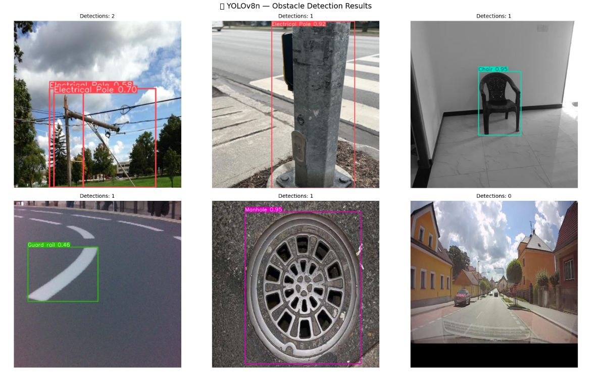
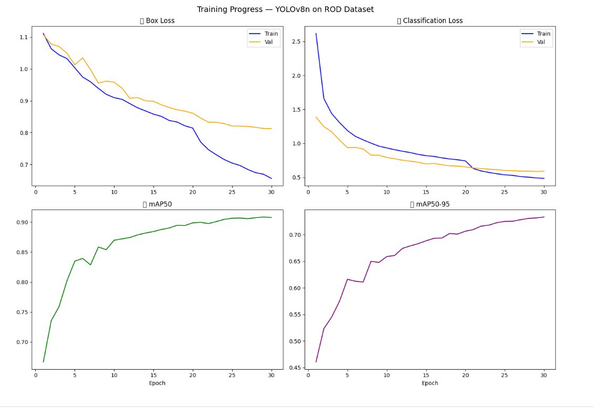

# Obstacle Detection for Assistive Navigation using YOLOv8n

## Overview

This project presents a real-time obstacle detection system designed to assist visually impaired pedestrians in navigating sidewalks safely. The model detects 25 different types of street obstacles using YOLOv8n and can be deployed on mobile devices for real-time inference.

## Project Highlights

- Real-time object detection using YOLOv8n
- Trained on 24,000+ annotated images
- Detects 25 obstacle categories
- Built using PyTorch and Ultralytics YOLOv8
- Includes model evaluation and per-class performance analysis

---

## Dataset

**ROD (Road Obstacle Detection) Dataset**

- 24,000+ annotated images
- 25 obstacle classes
- Public benchmark dataset for road obstacle detection

---

## Model Performance

| Metric | Score |
|--------|-------|
| mAP@50 | **90.7%** |
| mAP@50-95 | **73.2%** |

### Best Performing Classes

- Fire Hydrant — **99.5% mAP@50**
- Manhole — **96.5% mAP@50**

---

## Technologies Used

- Python
- PyTorch
- Ultralytics YOLOv8
- OpenCV
- NumPy
- Pandas
- Matplotlib

---

## Sample Predictions

> *(Insert your prediction image here)*



---

## Training Curves

> *(Insert the training curves here)*



---

## Repository Structure

```
Obstacle-Detection-for-Assistive-Navigation
│
├── notebooks
├── results
├── README.md
├── requirements.txt
└── inference.py
```

---

## Future Improvements

- Improve low-performing classes using targeted data augmentation.
- Export the model to ONNX or TensorRT for faster deployment.
- Deploy the model on mobile devices for real-time navigation assistance.

---

## Author

**Dina Adel**
